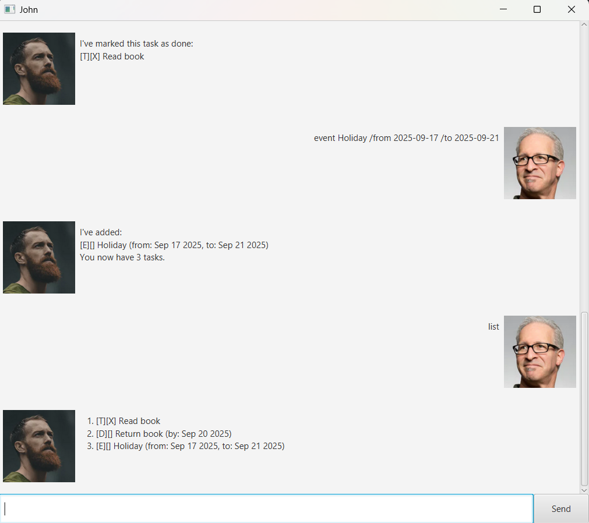

# John User Guide



John is a helpful chatbot designed to help you track and organize your tasks.

## Quickstart

To get started with John:

1. download him from [Releases](https://github.com/hai0506/ip/releases).
2. open command prompt at the root folder containing the jar file.
3. run the command:
```
java -jar John.jar
```

## Features

### - `todo`

Creates a todo task.

Example: `todo Read Book`

```
I've added: 
[T][] Read Book
You now have 1 tasks
```

### - `deadline`

Creates a deadline task.

Example: `deadline Return Book /by 2025-09-20`

```
I've added: 
[D][] Return Book (by: Sep 20 2025)
You now have 2 tasks
```

### - `event`

Creates an event task.

Example: `event Holiday /from 2025-09-17 /to 2025-09-21`

```
I've added: 
[E][] Holiday (from: Sep 17 2025, to: Sep 21 2025)
You now have 3 tasks
```

### - `list`

Lists all tasks.

Example: `list`

```
1. [T][] Read Book
2. [D][] Return Book (by: Sep 20 2025)
3. [E][] Holiday (from: Sep 17 2025, to: Sep 21 2025)
```

### - `mark`

Marks a task as completed.

Example: `mark 2`

```
I've marked this task as done:
[D][X] Return Book (by: Sep 20 2025)
```

### - `unmark`

Unmarks a task as completed.

Example: `unmark 2`

```
I've marked this task as not completed yet:
[D][] Return Book (by: Sep 20 2025)
```

### - `find`

Find a task with description containing your search term.

Example: `find Book`

```
Here are the matching tasks in your list:
1. [T][] Read Book
2. [D][] Return Book (by: Sep 20 2025)
```

### - `delete`

Deletes a task.

Example: `delete 1`

```
I've removed:
[T][] Read Book
You now have 2 tasks.
```

### - `undo`

Undoes your last change to the task list.

Example: `undo`

```
I have undone your last change to the task list.
Your tasks are now:
1. [T][] Read Book
2. [D][] Return Book (by: Sep 20 2025)
3. [E][] Holiday (from: Sep 17 2025, to: Sep 21 2025)
```

### - `bye`

Exits the program.

Example: `bye`

```
Bye!
```